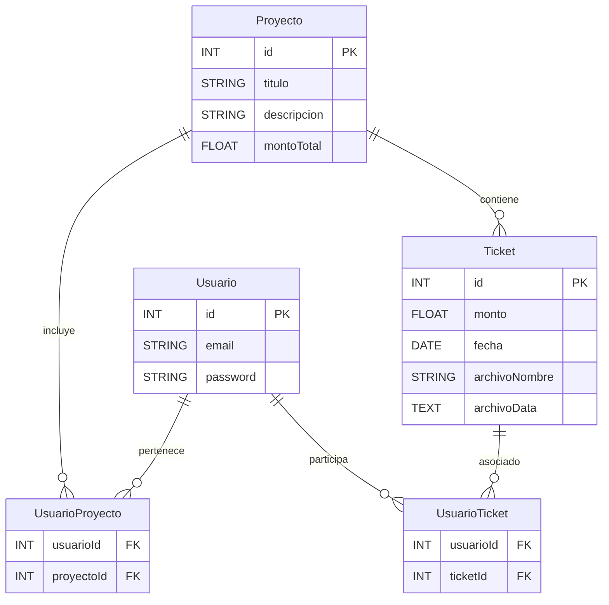

# Aplicación Backend en Node.js con Express

Esta es una aplicación backend desarrollada en **Node.js** utilizando el framework **Express**. Está diseñada para gestionar diversos aspectos de la administración de proyectos, incluyendo el registro de usuarios, gestión de tickets, y más.

La aplicación integra servicios de envío de correos electrónicos mediante **Resend** y almacenamiento de archivos en la nube usando **Cloudinary**.

---

## Configuración del Entorno
Este proyecto requiere un archivo .env configurado para el entorno de desarrollo. La estructura del archivo debe ser la siguiente:

```bash
PORT=8080
NODE_ENV=develope

# ---------------DB--------------------------
DEV_DB_USERNAME=root
DEV_DB_PASSWORD=xxx
DEV_DB_NAME=administrando

# ---------------IMAGE_HOSTING--------------------------
CLOUD_NAME=xx
CLOUDINARY_API_KEY=xx
CLOUDINARY_SECRET=xx

# ---------------MAILING--------------------------
# Resend
RESEND_API_KEY=xx

# ---------------JWT--------------------------
JWT_SECRET=QWS12
JWT_EXPIRES_IN=1h

```

## Postman Collection

La colección de Postman que cubre todos los endpoints de la API se puede encontrar en el siguiente [Enlace a Postman](https://documenter.getpostman.com/view/39583512/2sAYBYfVSy) .


# Base de Datos

Este proyecto utiliza un esquema relacional con las siguientes tablas: **Usuarios**, **Proyectos**, **Tickets**, **UsuarioProyecto** y **UsuarioTicket**.

---

## **Descripción de las Tablas**

### **Usuarios**
Contiene la información de los usuarios registrados en el sistema.

- `id` (PK): Identificador único.
- `email`: Correo electrónico del usuario.
- `password`: Contraseña del usuario.

### **Proyectos**
Detalla los proyectos disponibles.

- `id` (PK): Identificador único.
- `titulo`: Título del proyecto.
- `descripcion`: Breve descripción del proyecto.
- `montoTotal`: Monto total asignado al proyecto.

### **Tickets**
Registra los gastos relacionados con cada proyecto.

- `id` (PK): Identificador único.
- `monto`: Monto del gasto.
- `fecha`: Fecha del gasto.
- `archivoNombre`: Nombre del archivo asociado al ticket.
- `archivoData`: Datos binarios del archivo.

### **UsuarioProyecto**
Tabla intermedia para la relación muchos a muchos entre **Usuarios** y **Proyectos**.

- `usuarioId` (FK): Relación con la tabla **Usuarios**.
- `proyectoId` (FK): Relación con la tabla **Proyectos**.

### **UsuarioTicket**
Tabla intermedia para la relación muchos a muchos entre **Usuarios** y **Tickets**.

- `usuarioId` (FK): Relación con la tabla **Usuarios**.
- `ticketId` (FK): Relación con la tabla **Tickets**.

---

## **Descripción de Relaciones**

### **Usuarios-Proyectos**
- Un **usuario** puede pertenecer a varios **proyectos**.
- Un **proyecto** puede tener varios **usuarios**.

### **Proyectos-Tickets**
- Cada **proyecto** puede tener varios **tickets**.
- Cada **ticket** pertenece a un **proyecto**.

### **Usuarios-Tickets**
- Un **usuario** puede estar asociado a varios **tickets**.
- Un **ticket** puede involucrar a varios **usuarios**.

---

## **Diagrama Entidad-Relación (DER)**


