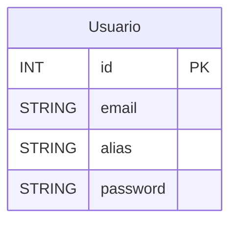

# Aplicación Backend en Node.js con Express

Esta es una aplicación backend desarrollada en **Node.js** utilizando el framework **Express**. Está diseñada para gestionar diversos aspectos de la administración de receta, incluyendo el registro de usuarios, gestión de recetas, y más.

La aplicación integra servicios de envío de correos electrónicos mediante **Resend** y almacenamiento de archivos en la nube usando **Cloudinary**.

---

## Configuración del Entorno
Este proyecto requiere un archivo .env configurado para el entorno de desarrollo. La estructura del archivo debe ser la siguiente:

```bash

SECRET=supersecret
DATABASE1=mongodb+srv://xxxx@cluster0.hjsieb8.mongodb.net/
DATABASE2=faccarrizo?retryWrites
DATABASE3=true&w
DATABASE4=majority
HOST=127.0.0.1
PORT=4000
DATABASE_NAME=Cluster0

# ---------------JWT--------------------------
JWT_SECRET=QWS12
JWT_EXPIRES_IN=1h

# ---------------IMAGE_HOSTING--------------------------
CLOUD_NAME=xx
CLOUDINARY_API_KEY=xx
CLOUDINARY_SECRET=xx

# ---------------MAILING--------------------------
# Resend
RESEND_API_KEY=xx


```

## Postman Collection

La colección de Postman que cubre todos los endpoints de la API se puede encontrar en el siguiente [Enlace a Postman](https://documenter.getpostman.com/view/39583512/2sB2cUCNto) .


# Base de Datos

Este proyecto utiliza un esquema relacional con las siguientes tablas: **Usuarios**, wip.

---

## **Descripción de las Tablas**

### **Usuarios**
Contiene la información de los usuarios registrados en el sistema.

- `id` (PK): Identificador único.
- `email`: Correo electrónico del usuario.
- `alias`: Identificador del usuario.
- `password`: Contraseña del usuario.


## **Diagrama Entidad-Relación (DER)**


---
## **Diagrama de Arquitectura**

```
                +-------------------------+
                |    Mobile App (RN)      |
                |   - React Native        |
                +-----------+-------------+
                            |
                            | HTTPS (REST API)
                            v
              +-------------+--------------+
              |       Backend (Node.js)    |
              | - Express / NestJS         |
              | - JWT Auth                 |
              | - Conexión MongoDB Atlas   |
              | - Mail: Resend API         |
              | - Imágenes: Cloudinary     |
              +------+----------+----------+
                     |          |
         +-----------+          +-----------+
         |                                  |
 +-------v-------+              +----------v-------------+
 | MongoDB Atlas |              |  Servicios externos    |
 |(DB en la nube)|              |  - Resend (Emails)     |
 +---------------+              |  - Cloudinary (Imgs)   |
                                +------------------------+

```

---

## **Diagrama de Despliegue**
```
+--------------------+
|  Usuario con App   |
|   React Native     |
+---------+----------+
          |
          | HTTPS
          v
+---------+----------+
|  Hosting Genérico  |
| (Render, Railway…) |
|   Node.js Backend  |
+----+-----------+---+
     |           |
     |           |
     v           v
+--------------+ +-------------------+ +--------------------+
| MongoDB Atlas| | Resend (Email API)| | Cloudinary (Imgs)  |
+--------------+ +-------------------+ +--------------------+

```

