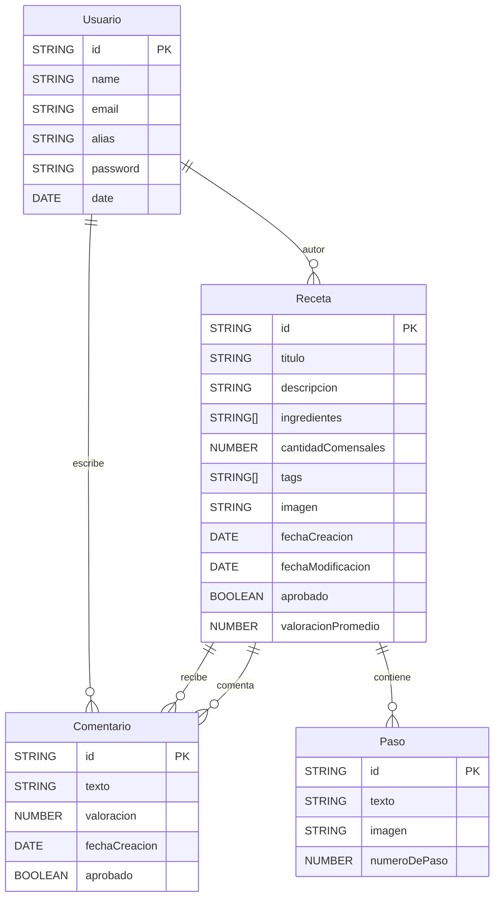

# Integrantes

| Legajo   | Nombre completo             |
|----------|-----------------------------|
| 1116155  | Amed, Maria Agustina        |
| 1185379  | Carrizo, Facundo Martin     |
| 1170887  | Yáñez, Agustin              |
| 94108    | Claros, Jose Luis           |

---

# Documento


Entrega de dieseño con los prototipos [link](https://docs.google.com/document/d/1bSAWG5i4eog7P7Ic70Igrkrjt7FfLNoo/edit)

---

# Aplicación Backend en Node.js con Express

Esta es una aplicación backend desarrollada en **Node.js** utilizando el framework **Express**. Está diseñada para gestionar diversos aspectos de la administración de receta, incluyendo el registro de usuarios, gestión de recetas, y más.

La aplicación integra servicios de envío de correos electrónicos mediante **Resend** y almacenamiento de archivos en la nube usando **Cloudinary**.

---

## Configuración del Entorno
Este proyecto requiere un archivo .env configurado para el entorno de desarrollo. La estructura del archivo debe ser la siguiente:

```bash

SECRET=supersecret
DATABASE1=mongodb+srv://xxxx@cluster0.hjsieb8.mongodb.net/
DATABASE2=faccarrizo?retryWrites
DATABASE3=true&w
DATABASE4=majority
HOST=127.0.0.1
PORT=4000
DATABASE_NAME=Cluster0

# ---------------JWT--------------------------
JWT_SECRET=QWS12
JWT_EXPIRES_IN=1h

# ---------------IMAGE_HOSTING--------------------------
CLOUD_NAME=xx
CLOUDINARY_API_KEY=xx
CLOUDINARY_SECRET=xx

# ---------------MAILING--------------------------
# Resend
RESEND_API_KEY=xx


```

## Swagger

Endpoints de la [API](https://app.swaggerhub.com/apis/desarrolloapi/UADE/1.0.0) .


# Base de Datos

Este proyecto utiliza un esquema relacional con las siguientes tablas: **Usuarios**, wip.

---

## **Descripción de las Tablas**

### **Usuarios**
Contiene la información de los usuarios registrados en el sistema.

- `id` (PK): Identificador único.  
- `name`: Nombre del usuario.  
- `email`: Correo electrónico del usuario.  
- `alias`: Identificador del usuario.  
- `password`: Contraseña del usuario.  
- `date`: Fecha de registro del usuario.  


### **Recetas**
Contiene la información de las recetas creadas por los usuarios.

- `id` (PK): Identificador único.  
- `titulo`: Título de la receta.  
- `descripcion`: Descripción de la receta.  
- `ingredientes`: Lista de ingredientes con cantidad y unidad de medida.  
- `pasos`: Referencias a pasos asociados.  
- `cantidadComensales`: Cantidad de personas que alcanza la receta.  
- `tags`: Etiquetas categóricas (ej. Vegano, SinGluten).  
- `imagen`: URL de la imagen principal.  
- `autor`: Referencia al usuario creador.  
- `fechaCreacion`: Fecha de creación.  
- `fechaModificacion`: Fecha de última modificación.  
- `aprobado`: Indica si está aprobada.  
- `valoracionPromedio`: Valoración promedio de usuarios.  
- `comentarios`: Referencias a comentarios asociados.  


### **Comentarios**
Contiene las valoraciones y opiniones sobre las recetas.

- `id` (PK): Identificador único.  
- `texto`: Texto del comentario.  
- `valoracion`: Puntuación del 1 al 5.  
- `usuario`: Referencia al usuario que comentó.  
- `receta`: Referencia a la receta comentada.  
- `fechaCreacion`: Fecha en la que se hizo el comentario.  
- `aprobado`: Indica si el comentario está aprobado.  


### **Pasos**
Contiene los pasos individuales para realizar una receta.

- `id` (PK): Identificador único.  
- `texto`: Descripción del paso.  
- `imagen`: URL de imagen ilustrativa (opcional).  
- `receta`: Referencia a la receta a la que pertenece.  
- `numeroDePaso`: Orden del paso en la receta.  


## **Diagrama Entidad-Relación (DER)**


---
## **Diagrama de Arquitectura**

```
                +-------------------------+
                |    Mobile App (RN)      |
                |   - React Native        |
                +-----------+-------------+
                            |
                            | HTTPS (REST API)
                            v
              +-------------+--------------+
              |       Backend (Node.js)    |
              | - Express / NestJS         |
              | - JWT Auth                 |
              | - Conexión MongoDB Atlas   |
              | - Mail: Resend API         |
              | - Imágenes: Cloudinary     |
              +------+----------+----------+
                     |          |
         +-----------+          +-----------+
         |                                  |
 +-------v-------+              +----------v-------------+
 | MongoDB Atlas |              |  Servicios externos    |
 |(DB en la nube)|              |  - Resend (Emails)     |
 +---------------+              |  - Cloudinary (Imgs)   |
                                +------------------------+

```

---

## **Diagrama de Despliegue**
```
+--------------------+
|  Usuario con App   |
|   React Native     |
+---------+----------+
          |
          | HTTPS
          v
+---------+----------+
|  Hosting Genérico  |
| (Render, Railway…) |
|   Node.js Backend  |
+----+-----------+---+
     |           |
     |           |
     v           v
+--------------+ +-------------------+ +--------------------+
| MongoDB Atlas| | Resend (Email API)| | Cloudinary (Imgs)  |
+--------------+ +-------------------+ +--------------------+

```

